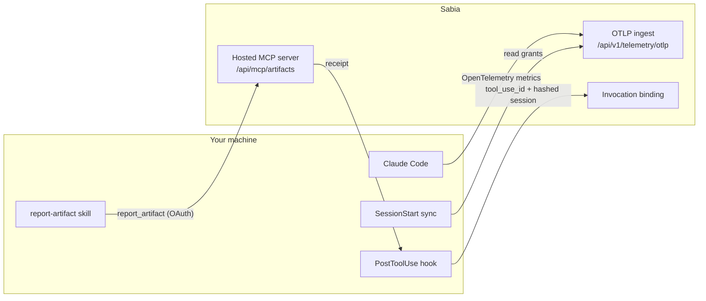

# Sabia for Claude Code

**See what Claude Code actually shipped, and what it cost to ship it.**

[](https://github.com/Sabia-Partners/sabia-claude-plugin/actions/workflows/ci.yml)
[](LICENSE)


Sabia is AI cost intelligence for teams. This plugin connects Claude Code to
your team's Sabia workspace in two ways, and you approve each one separately:

- **Completed-work reporting.** When Claude Code opens a pull request, files an
  issue or revises a document, it records that work in Sabia.
- **Native usage.** Claude Code's built-in OpenTelemetry token counts go to
  Sabia, including Max and Pro subscription usage that never appears in
  Anthropic's API cost reports.

With both connected, Sabia links each piece of work to the session and tokens
that produced it.

## Quick start

```text
/plugin marketplace add Sabia-Partners/sabia-claude-plugin
/plugin install sabia-claude-code-otel@sabia
```

Then ask Claude to **"connect Sabia"** for native usage, and run `/mcp` →
`plugin:sabia-claude-code-otel:sabia-artifacts` to connect completed-work
reporting. [SETUP.md](SETUP.md) walks through both, step by step.

You need a Sabia workspace. Talk to [Sabia Partners](mailto:hello@sabiapartners.com)
if your team does not have one yet.

## What leaves your machine

Nothing is sent until you connect. After that, only what the table shows for
your connection is sent.

| Connection | Sent to Sabia | Never sent |
| --- | --- | --- |
| **Completed-work reporting** | For each completed piece of work: an action, a short title, the artifact type, its provider reference and identifiers, and available evidence references. | Document bodies, prompts, transcripts, file contents. |
| **Native usage** (default) | Token counts from Claude Code's OpenTelemetry **metrics** export. | Prompts, responses, tool arguments, file contents. Log and trace exporters stay `none`. |
| **Report binding** (both connected) | The report's `tool_use_id` and a SHA-256 of the session id, hashed on this machine. | The raw session id, transcript, tool input, usage values. |

Titles and references can still contain sensitive information, so review what
Claude reports the same way you would review a commit message.

### Opt-in capture grants

Two more grants widen native usage. Each one is off by default, needs an
owner or administrator of your Sabia organization to approve it in the browser,
and is recorded on the connection's key rather than on this machine.

| Grant | Adds | Still never sent |
| --- | --- | --- |
| **Tool output** (`--tool-output`) | Tool result bodies and the command lines that produced them, so work like `gh pr create` shows on Sabia's Output page. Sabia keeps a reduced extract per tool and drops file-tool bodies. | Prompt text, assistant responses, raw API bodies. |
| **Raw capture** (`--raw-capture`) | Prompt text and tool decisions from Claude Code's log export, retained as complete envelopes. Pre-production, for shaping Sabia's analysis from real data. | Assistant responses, raw API bodies. |

Everyone in your Sabia organization can read what these grants capture.

> [!IMPORTANT]
> Capture grants are managed in Sabia. An owner or administrator can change a
> device's grants later in **Settings → Usage connections**, and the plugin's
> session-start sync applies the change: it prints a notice in the session where
> it happens, and the new capture starts from the session after that. To stop
> sharing, run `disconnect` or remove the device in Sabia.

## How it works



| Piece | What it does |
| --- | --- |
| [`.mcp.json`](.mcp.json) | Bundles Sabia's hosted MCP server as `sabia-artifacts`. It is HTTP with OAuth, and nothing runs locally. |
| [`skills/report-artifact`](skills/report-artifact/SKILL.md) | Tells Claude when a completed create, update, send, publish or deliver is worth reporting, and how to report it. |
| [`skills/connect-sabia`](skills/connect-sabia/SKILL.md) | Connects, checks, rotates and disconnects native usage. |
| [`scripts/sabia.mjs`](scripts/sabia.mjs) | Writes and removes the managed OpenTelemetry block in `settings.json`. Unrelated keys are preserved. |
| [`scripts/sabia-report-binding.mjs`](scripts/sabia-report-binding.mjs) | Links an accepted report to the tool call and session that made it. |
| [`hooks/hooks.json`](hooks/hooks.json) | Runs `sync` and the binding retry at session start, and the binding after `report_artifact`. |

A report records that work was done. It never performs the work, and a
reporting failure never means the original operation failed.

## Commands

The `connect-sabia` skill runs these for you. You can also run them from the
plugin directory:

```text
node scripts/sabia.mjs connect      # browser approval, writes the exporter settings
node scripts/sabia.mjs status       # organization, endpoint and active grants
node scripts/sabia.mjs sync         # apply grants changed in Sabia
node scripts/sabia.mjs disconnect   # revoke the key and restore previous settings
```

Claude Code reads its environment when a session starts, so **start a new
session** after connecting. Settings live in `$CLAUDE_CONFIG_DIR` when that is
set, and in `~/.claude` otherwise.

## Uninstall

1. `node scripts/sabia.mjs disconnect` revokes the native usage key and
   restores whatever the managed variables held before.
2. `/mcp` → `sabia-artifacts` → *Clear authentication* disconnects reporting on
   this machine. Revoke it for good in Sabia → Settings → Artifact reporting.
3. `/plugin uninstall sabia-claude-code-otel@sabia`.

Records Sabia already accepted stay in your workspace.

## Cowork

[`cowork/`](cowork/README.md) is an administrator helper for Claude Cowork's
OpenTelemetry export. It is a script rather than a plugin, and the marketplace
entry does not load it.

## Development

```text
pnpm install --frozen-lockfile
pnpm check
pnpm test
```

The tests cover connect, sync and disconnect against a local handoff server,
the Cowork helper, the plugin manifest and the report-binding hook. The shared
report contract is pinned in [`contracts/v2`](contracts/v2/README.md).

To release, tag `vX.Y.Z`. The release workflow runs the checks and attaches
`sabia-claude-plugin.tar.gz`. The installed identifier stays
`sabia-claude-code-otel` so existing installations keep their device id,
connection and grants.

## Security and license

Report vulnerabilities privately. [SECURITY.md](SECURITY.md) explains how.
Released under the [MIT License](LICENSE).
